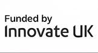

---
redirect_from:
  - home/
  - cive60008_21/
  - cive60008_22/assignments/1/
  - cive60008_21/week01/seminar1/
  - cive60008_22/
  - cive60008_22/week06/notebooks/
  - cive97129_23/assignments/2/
  - demo-pathfinding/
  - project/shift-project/
  - research/autonomy/
  - research/logistics/
  - tags/
  - tag/autonomy
  - teaching/
  - tf/
  - tf/60008_21/
  - wsds/
---

The Transport Systems & Logistics Laboratory focuses on the algorithms and models for the **design**, **management** and **deployment** of **autonomous transport systems**, in **land**, **air** and **water**. Our emphasis is on  **distributed control**, optimising **freight distribution** and building **resilience against disruptions**.

Led by [**Dr Panagiotis Angeloudis**](/members/angeloudis-p), our team has expertise in **transportation**, **optimisation**, **machine learning** and **robotics**. We have strong links with our academic collaborators, industrial partners and policymakers.

Our work aims to advance the adoption of automation and increase the efficiency and sustainability of the transportation sector.







Our research focuses on how transport systems can become more efficient, safe and resilient, through the three interlinked strands of **autonomy**, **modelling** and **control** for **strategic and tactical decision making**. The models we built incorporate the effects of operational uncertainty (future demand, operational disruptions, targetted attacks) in real-world operations. 

We have sought solutions using **optimisation**, **reinforcement learning**, **network modelling**, and bespokely developed high performance **agent based modelling** tools.









Our researchers benefit from the strong links of our group with other laboratories within the Imperial College community, external collaborators, and industry partners. Our alumni have achieved success in academia, secured influential roles in industry, or launched their own startups.

**Join us:** We are looking for talented researchers to join our team, and to contribute to the development of next generation of models and technologies for transport systems and logistics. Several sholarships are available for qualified applicants.









#### Our Themes









#### Our Funders






















